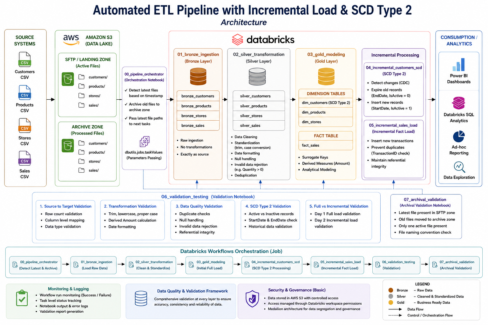

# Retail ETL Data Warehouse Pipeline

## Project Overview

This project implements an end-to-end Retail ETL Data Warehouse Pipeline using AWS S3 and Databricks following the Medallion Architecture (Bronze, Silver, Gold).

The solution simulates a real-world retail data warehouse scenario where source files arrive incrementally through an SFTP landing zone. The pipeline performs ingestion, transformation, validation, archival, incremental processing, CDC (Change Data Capture), and SCD Type 2 implementation.

The workflow is fully orchestrated using Databricks Jobs/Workflows.

---

# Architecture

```text
SFTP Landing Zone
        ↓
Bronze Layer (Raw Data)
        ↓
Silver Layer (Cleaned Data)
        ↓
Gold Layer (Business Data Warehouse)
        ↓
Validation & Reporting
```

---
## Architecture



# Technologies Used

* AWS S3
* Databricks
* PySpark
* Spark SQL
* Databricks Workflows (Jobs)
* Medallion Architecture
* CDC (Change Data Capture)
* SCD Type 2

---

# S3 Folder Structure

```text
s3://salessprintt9/
│
├── sftp/
│   ├── customers/
│   ├── products/
│   ├── stores/
│   └── sales/
│
├── archive/
│   ├── customers/
│   ├── products/
│   ├── stores/
│   └── sales/
│
├── bronze/
├── silver/
└── gold/
```

---

# Source Files

## Initial Full Load Files

```text
customers_src_20042026100105.csv
products_src_20042026100105.csv
stores_src_20042026100107.csv
sales_transactions_src_20042026100107.csv
```

## Incremental Load Files

```text
customers_src_21042026100105.csv
sales_transactions_src_21042026100107.csv
```

---

# Business Requirements

* Build a Sales Data Warehouse consisting of:

  * Customers
  * Products
  * Stores
  * Daily Sales Facts

* Implement Bronze, Silver, and Gold layers.

* Implement archival process.

* Detect latest files using timestamp naming convention.

* Perform incremental loading.

* Apply CDC logic.

* Implement SCD Type 2 for customers.

* Validate ETL pipeline end-to-end.

---

# Medallion Architecture

## Bronze Layer

Stores raw ingested data exactly as received from source systems.

### Bronze Tables

* bronze_customers
* bronze_products
* bronze_stores
* bronze_sales

---

## Silver Layer

Performs data cleansing and standardization.

### Transformations Performed

### Customers

* Trim spaces
* Convert emails to lowercase
* Standardize names using INITCAP
* Convert dates using TO_DATE

### Products

* Trim product names
* Standardize data types

### Stores

* Proper case formatting
* Null handling for region

### Sales

* Remove Quantity = 0
* Standardize date format
* Convert numeric data types

### Silver Tables

* silver_customers
* silver_products
* silver_stores
* silver_sales

---

## Gold Layer

Implements dimensional modeling.

### Dimension Tables

* dim_customers
* dim_products
* dim_stores

### Fact Table

* fact_sales

### Features Implemented

* Surrogate Keys
* SCD Type 2
* Incremental Fact Loading
* Derived Amount Calculation

---

# SCD Type 2 Implementation

SCD Type 2 was implemented on Customer Dimension.

## Logic

When customer information changes:

* Old record becomes inactive
* EndDate updated
* New active record inserted

### SCD Columns

* CustomerSK
* StartDate
* EndDate
* IsActive

---

# Incremental Load Logic

## Day 1

* Full Load executed.
* Gold tables created.

## Day 2

Incremental files added to SFTP.

### Customers

* New customers inserted
* Changed customers updated using SCD Type 2
* Unchanged customers ignored

### Sales

* Only new TransactionIDs inserted
* Duplicate transactions ignored
* Invalid records rejected

---

# CDC (Change Data Capture)

CDC logic compares incoming customer data against active Gold dimension records.

Changes detected using:

```sql
City <> existing City
OR
Address <> existing Address
```

---

# Archival Process

When a new file arrives:

* Latest file retained in SFTP
* Previous file moved to archive

### Example

```text
sftp/customers/customers_src_21042026100105.csv
```

Old file moved to:

```text
archive/customers/customers_src_20042026100105.csv
```

---

# Workflow Automation

Databricks Workflow was used to automate the ETL pipeline.

## Workflow Tasks

```text
00_pipeline_orchestrator
→ 01_bronze_ingestion
→ 02_silver_transformation
→ 04_incremental_customers_scd
→ 05_incremental_sales_load
→ 06_validation_testing
```

---

# ETL Testing Scope

## 1. Source to Target Testing

* Row count validation
* Column mapping validation
* Data type validation

## 2. Data Transformation Testing

* Trim validation
* Lowercase validation
* Proper case validation
* Date formatting validation
* Derived Amount validation

## 3. Data Quality Testing

* Duplicate validation
* Null handling
* Invalid Quantity rejection
* Referential integrity validation

## 4. SCD Type 2 Testing

* Active vs inactive records
* Historical record validation
* StartDate and EndDate validation

## 5. Full Load vs Incremental Load Testing

* Day 1 Full Load
* Day 2 Incremental Load

## 6. Archival Validation

* Latest file validation
* Archive movement validation
* Timestamp naming validation

---

# Validation Queries Implemented

## Duplicate Transaction Validation

```sql
SELECT TransactionID, COUNT(*)
FROM fact_sales
GROUP BY TransactionID
HAVING COUNT(*) > 1;
```

## Referential Integrity Validation

```sql
SELECT *
FROM fact_sales
WHERE CustomerSK IS NULL
   OR ProductSK IS NULL
   OR StoreSK IS NULL;
```

## Amount Validation

```sql
SELECT
    f.TransactionID,
    f.Amount,
    f.Quantity * p.UnitPrice AS ExpectedAmount
FROM fact_sales f
JOIN dim_products p
ON f.ProductSK = p.ProductSK
WHERE f.Amount <> f.Quantity * p.UnitPrice;
```

## SCD Validation

```sql
SELECT *
FROM dim_customers
WHERE CustomerID IN (
    SELECT CustomerID
    FROM dim_customers
    GROUP BY CustomerID
    HAVING COUNT(*) > 1
);
```

---

# Key Features

* End-to-end ETL pipeline
* Incremental data loading
* CDC implementation
* SCD Type 2 implementation
* Automated archival logic
* Medallion architecture
* Workflow orchestration
* ETL validation framework

---

# Learning Outcomes

Through this project:

* Learned Medallion Architecture
* Implemented ETL workflows
* Performed incremental processing
* Implemented CDC and SCD Type 2
* Automated ETL using Databricks Workflows
* Validated data warehouse pipelines
* Simulated real-world ETL QA scenarios

---

# Conclusion

This project successfully demonstrates a production-style Retail ETL Data Warehouse Pipeline using AWS S3 and Databricks. The pipeline supports full and incremental loading, archival automation, CDC, SCD Type 2 processing, and comprehensive ETL validation testing.
